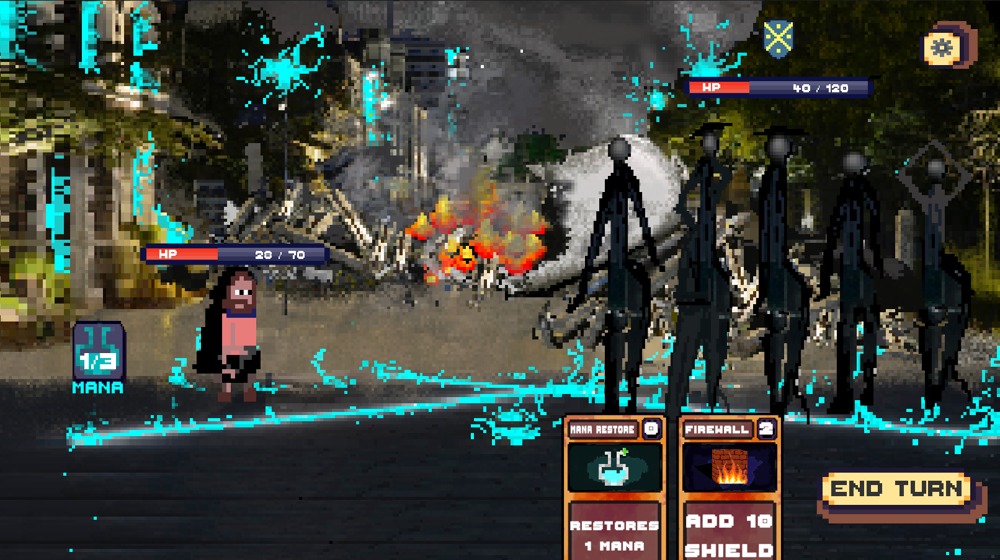
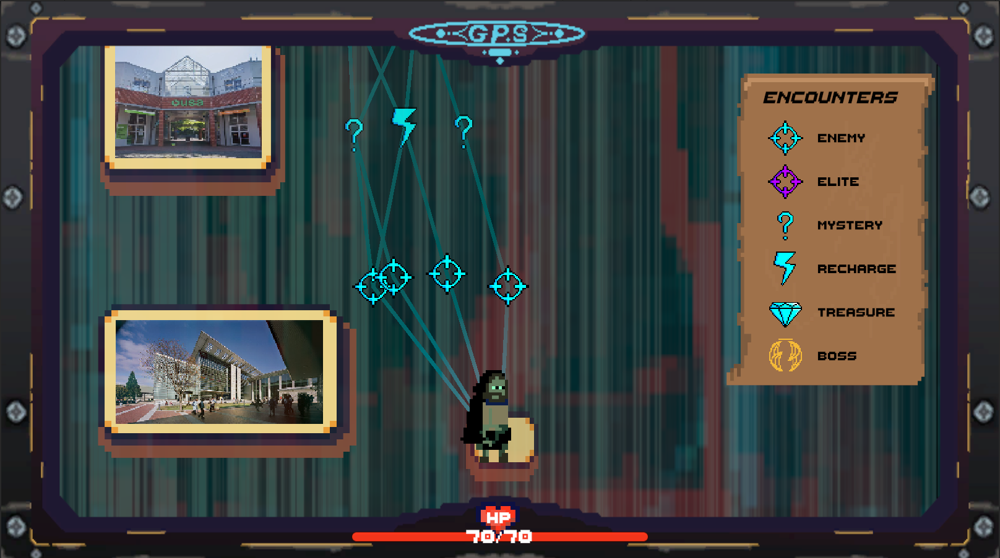
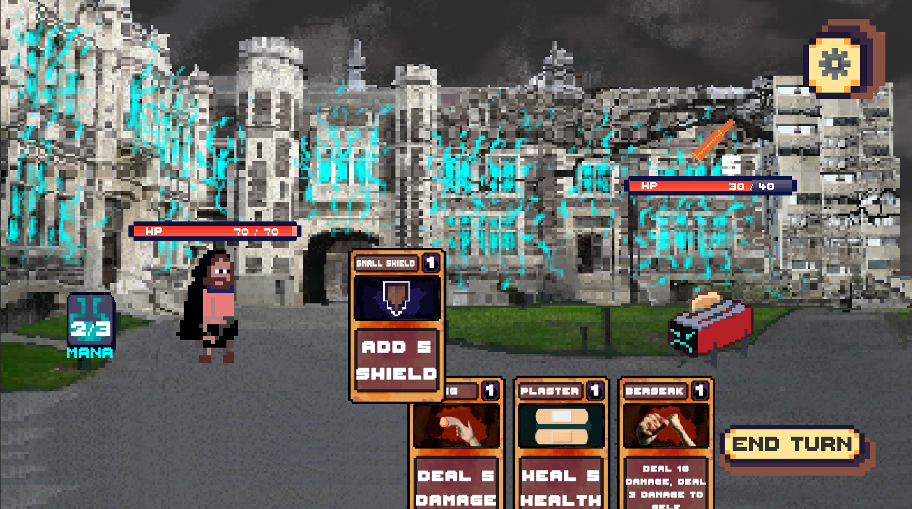
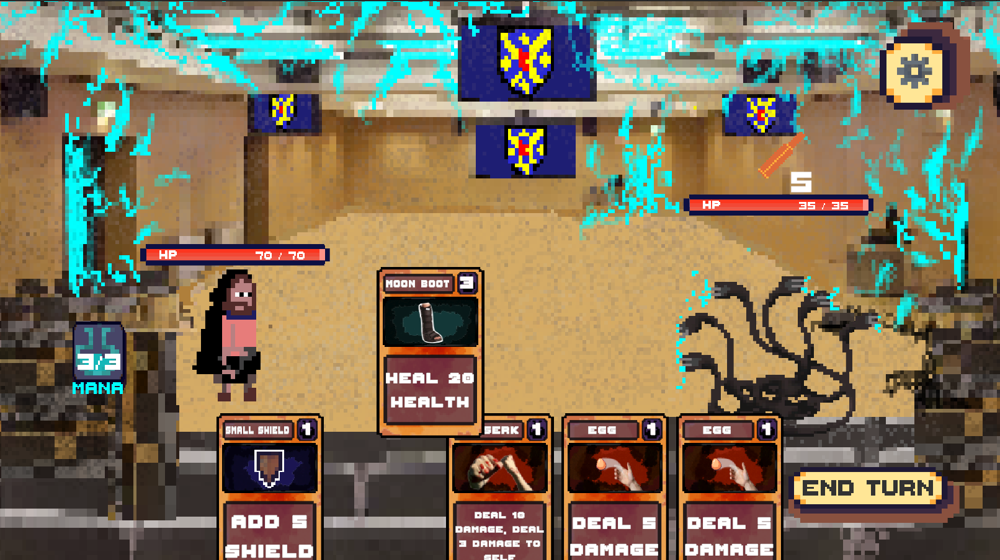
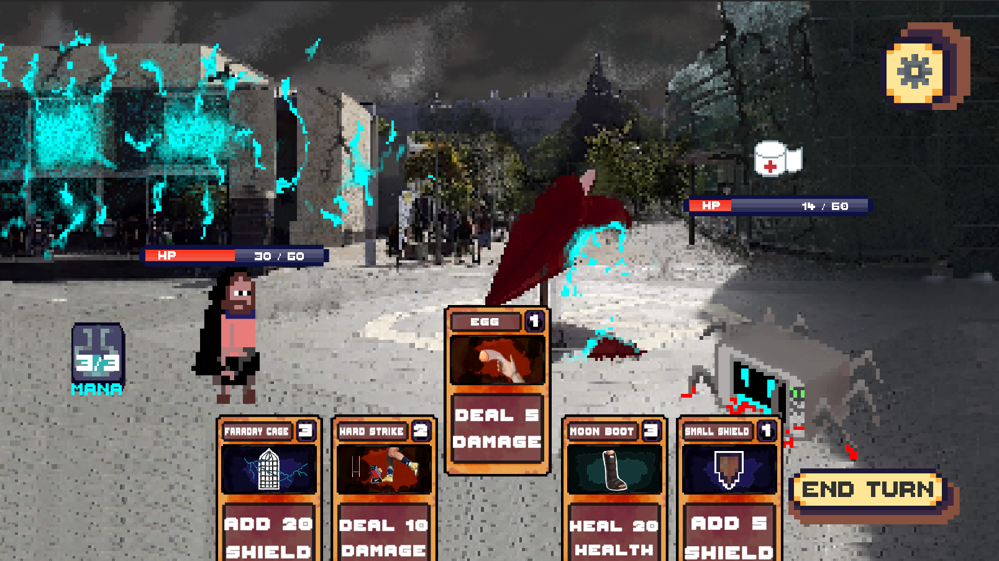
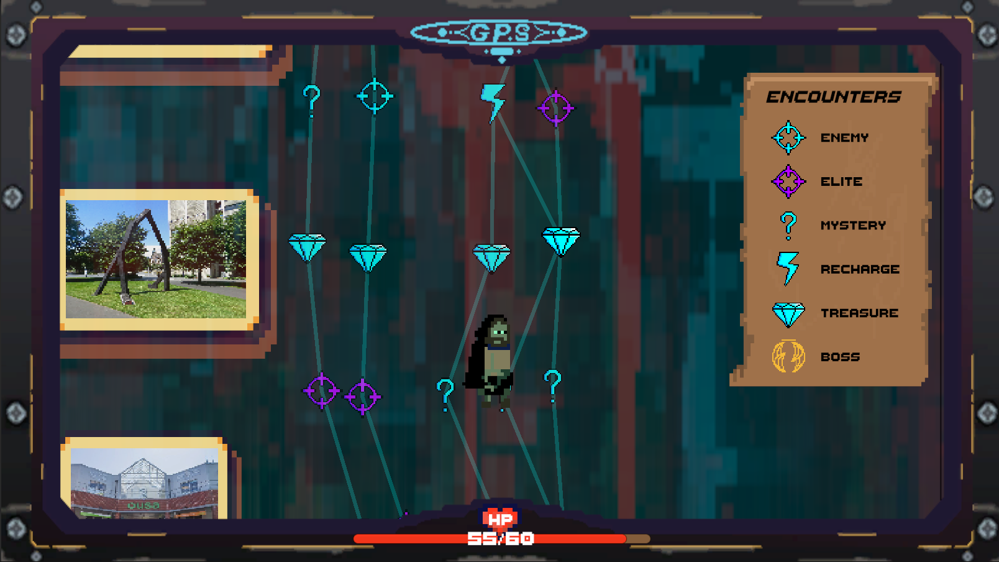

# Project: Liberate Owheo

## By:
- Janadhi Dissanayake - Lead Artist / Sound Design / Composer
- Luke Webb - Designer / Programmer / Artist
- Michael Campbell - Artist / Programmer / Designer
- Celeste Holt - Lead Programmer / Designer

**Project: Liberate Owheo is a rogue-like card game where you play as a disgruntled undergraduate at the University of Otago, who’s graduation was interrupted by an AI takeover. You must fight through various enemies that have been animated by the AI, in order to claim your degree and finally graduate. The game features twenty total cards each with their own unique art, that can be collected by completing combat encounters, or by getting lucky in mystery encounters. Discover and take on a variety of different enemies that use their own custom decks, and face our three unique boss fights to complete the game. Procedural map generation, random mystery encounters, and the random drop chance of cards, makes the game ideal for replayability. Can you defeat the AI and finally claim your degree?**

## Controls
- Left Click - Button selection
- Mouse Scroll Wheel - Map scroll
- Space - Exit/Skip cutscenes and mystery encounters.
- Click and drag cards to play their effects, provided you have enough mana!
  - Then click the “end turn” button when you’re ready for the enemy’s turn.

## Known Issues
- Selecting full screen while on the main menu obscures any of the buttons requiring you to reload the page. (selecting full screen while on the overworld map or combat should not produce this error)
## Credits
- All music and sounds in the game were created originally using Garageband. 
## Photos

